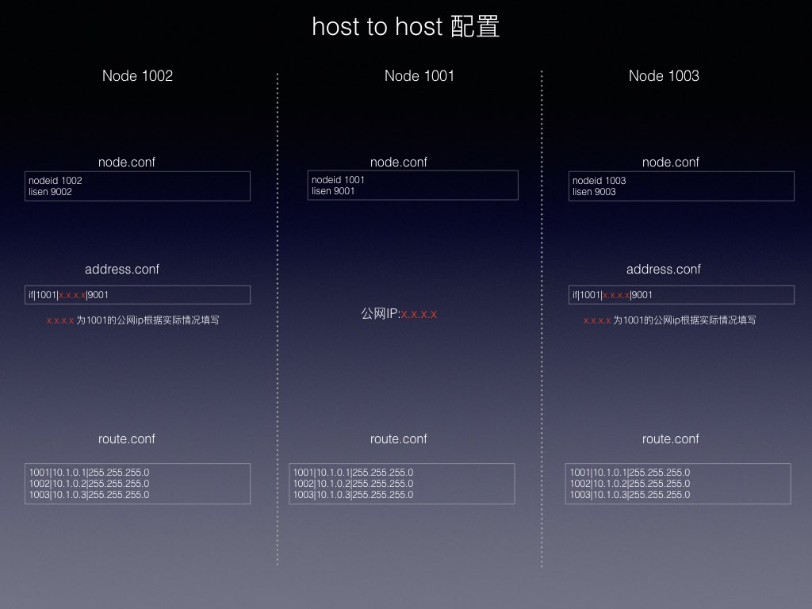

[OpenGNB](https://github.com/gnbdev/opengnb "OpenGNB")是一个开源的去中心化的具有极致内网穿透能力的通过P2P进行三层网络交换的虚拟组网系统。

本文以图解的方式对 GNB 三种内网穿透虚拟组网方式进行介绍并给出配置具体

GNB极致的NAT穿透能力使得两个异地网络很轻易实现点对点通讯，但考虑到还是会遇到不成功的时候，图中的1001节点属性被设为`forward` 和 `index`,这样NAT穿透失败的时候可以在用公网服务器中转数据。
通常的由志愿提供的公共索引节点是不提供`forward`服务的，因此如果打算在无法NAT穿透的极端情况下两个异地的计算机可以组网，那么就需要自行在公网搭建GNB的`forward` 和 `index`节点。

## host to host

host to host 是两台计算机通过GNB建立的虚拟链路进行通讯

## host to host配置

## host to net

host to net 一台计算机通过GNB接入一个网络，举例说，用户在咖啡厅、酒店用笔记本电脑通过GNB访问家中的整个内网。
这个场景里，图中右边的GNB建议运行在一台OpenWRT路由器上。

## host to net配置

左边这端，需要配置一条路由。

## net to net

net to net 这个模式是 两个异地的局域网通过 GNB 组成一个虚拟的网络，两个局域网中任意一台机器都能互联互通。

举例说，假如有两个异地的办公室需要互访，就可以通过这个方式不经过公网服务器中转就能虚拟组网，这两个异地办公室网络不需要有公网ip，也不需要公网服务器做中转。

## net to net配置

这个模式下，通常是把GNB运行在两台OpenWRT路由器上，并且要根据具体网络设好路由。

既然可以把两个异地的局域网组成一个虚拟局域网，也可以在这个基础上加入第三、第四个异地局域网。

## 关于gnb_udp_over_tcp

当遇到一些网络运营商对UDP实行QOS策略时，请参考 [gnb_udp_over_tcp](https://github.com/gnbdev/gnb_udp_over_tcp "gnb_udp_over_tcp")
[gnb_udp_over_tcp](https://github.com/gnbdev/gnb_udp_over_tcp "gnb_udp_over_tcp")是一个为GNB开发的通过tcp链路中转UDP分组转发的服务，也可以为其他基于UDP协议的服务中转数据。
